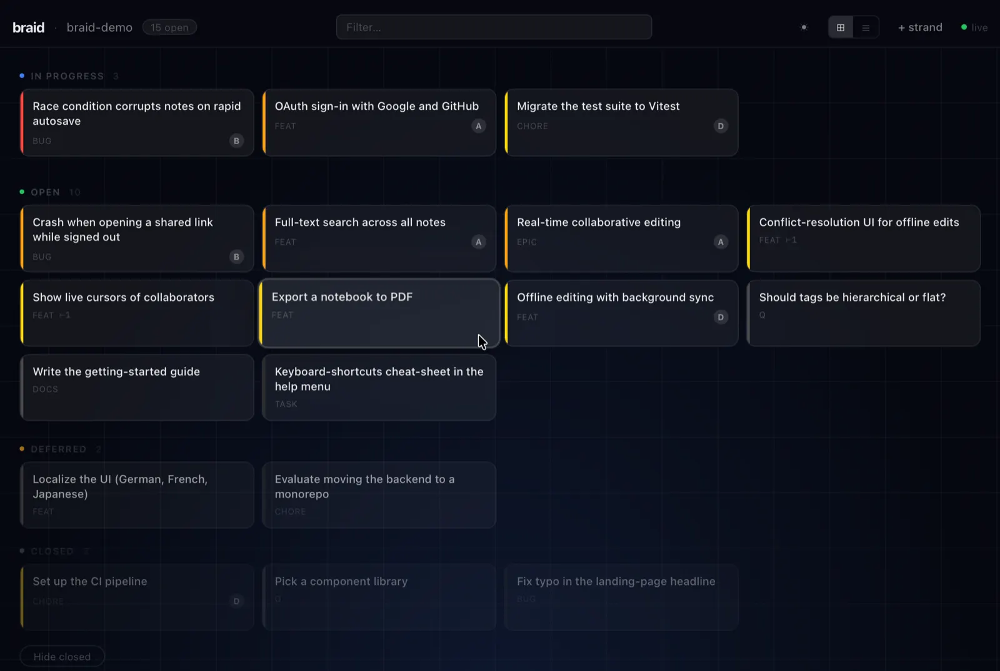

# braid

A local-first issue tracker for LLM agents (and the humans they work
with).

braid stores a project's issues in a **skein** — a single
[automerge](https://automerge.org) CRDT document, synced through an automerge
sync server. A single issue is a **strand**. There is no git involvement and
no daemon: any number of agents across machines, branches, and worktrees can
create, edit, and close strands in parallel, with replication and conflict
resolution coming from the CRDT rather than merge tooling. braid is heavily
inspired by [beads](https://github.com/steveyegge/beads).

📖 **[Documentation](https://cscheid.github.io/braid/)** — installation,
configuration, syncing, rotation, the MCP server, the desktop viewer, and the
JSONL contract.



## Install

```sh
curl -fsSL https://raw.githubusercontent.com/cscheid/braid/main/install.sh | bash
```

Installs a signed, checksum-verified release to `~/.local/bin` (needs
[minisign](https://jedisct1.github.io/minisign/)). Windows, specific versions,
build-from-source, and the signing key are in the
[installation guide](https://cscheid.github.io/braid/installation.html).

## Quick start

```sh
# in your project directory
braid init                  # creates a skein, writes .braid.toml
echo .braid.toml >> .gitignore

braid create "Fix the frobnicator" --type bug --priority 1
braid ready                 # what's workable right now
braid close br-x7k2m9q4 --reason "fixed"
```

On another machine / clone / worktree of the same project:

```sh
braid init --join <doc-id>  # paste the doc id from the first machine
braid list                  # open strands, fetched from the sync server
```

Agents: run `braid agents-info` for a complete, version-matched usage guide.

## ⚠️ The document id is a secret

The automerge doc id is a **bearer token**: anyone who has it can read *and
write* your skein, forever. Never commit `.braid.toml`; never paste the doc id
into issue text, logs, commits, or PRs. The default `wss://sync.automerge.org`
is a public community relay that stores your document unencrypted — run your
own sync server for real work. Full detail (and leak recovery via `braid
rotate`): [the security note](https://cscheid.github.io/braid/security.html).

## Contributing

The [development guide](https://cscheid.github.io/braid/development.html)
covers the workspace layout, tests, and how to build this documentation site
(an mdBook under `docs/`; `cargo xtask docs-serve` previews it locally). This
repo dogfoods braid — run `braid list` here to see its own skein.
